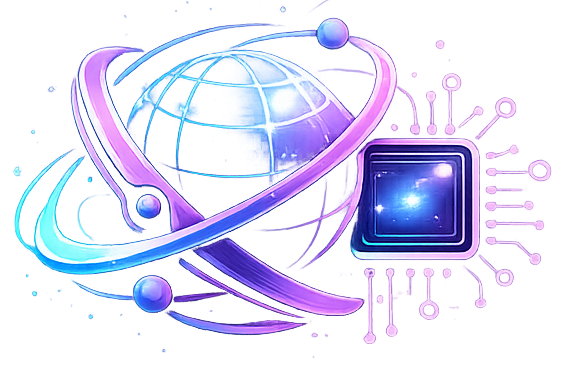

<h1>&nbsp;DeepSyncAI</h1>

<div>
  
  
  
  
  
  
  
  
  
  
  
  
  
  
</div>

## DeepSyncAI - Intelligent Multi-Agent Research Engine

### DeepSyncAI is an intelligent multi-agent research engine that autonomously searches the web, extracts relevant information from live sources, generates comprehensive research reports, and performs AI-powered critique — all from a single topic input.

### Designed with a modern agentic architecture, DeepSyncAI orchestrates a sequential four-stage research pipeline consisting of a real-time search agent, a deep extraction agent, an AI report generation agent, and an intelligent critic agent. The platform delivers structured Markdown outputs through a sleek four-tab interface with smooth animations, typewriter-style rendering, session history tracking, and a production-grade glassmorphism UI — creating a fast, interactive, and research-focused AI experience.

<h2>
<a href="https://deepsync-ai.vercel.app/" target="_blank" rel="noopener noreferrer">
&nbsp;DeepSyncAI Live: https://deepsync-ai.vercel.app
</a>
</h2>

<!--
<h2>
<a href="https://www.youtube.com/watch?v=YOUR_VIDEO_ID" target="_blank" rel="noopener noreferrer">
<p>📽️ DeepSyncAI Preview Video - Click here to watch the full video on YouTube
</p>
</a>
<p>

</p>
</h2>
-->

<h2 id="seo-result">
<a href="https://www.google.com/search?q=site:deepsync-ai.vercel.app" target="_blank" rel="noopener noreferrer">
<p>🔍 SEO Result - Click here to see</p>
</a>
</h2>

## ✨ Core Features

- **Multi-Agent Research Pipeline (Search &rarr; Extract &rarr; Report &rarr; Critic)**
- **Tavily-Powered Real-Time Web Search**
- **Deep Structured Content Extraction from Live Web Sources**
- **Gemini AI Research Report Generation**
- **AI-Powered Critic with Accuracy Scoring & Insightful Feedback**
- **Four-Tab Result Interface (Search / Extract / Report / Critic)**
- **Auto-Switching Tabs as Each Agent Completes**
- **Interactive Research History with Full Session Replay**
- **Structured & Formatted Markdown Output Rendering**
- **Rich Code Blocks with Copy Support**
- **Fast Typewriter-Style Output Animation**
- **Smooth UI Animations (Framer Motion)**
- **Fully Responsive Design**
- **Modern Dark UI with Black & Blue Glassmorphism Theme**
- **Real-Time Toast Notifications per Agent Step**
- **Client-Side Safe API Handling**

## 💻 Technologies Used

| **Technology**                    | Category                   | Purpose                                                              |
| --------------------------------- | -------------------------- | -------------------------------------------------------------------- |
| **Next.js (App Router)**          | Frontend Framework         | Full-stack React framework for routing, SSR, and API handling        |
| **React 19**                      | UI Library                 | Component-based user interface development                           |
| **Next.js API Routes**            | Backend APIs               | Secure server-side agent orchestration and AI request handling       |
| **Tailwind CSS 4**                | Styling and Responsiveness | Utility-first styling with a modern, responsive design system        |
| **Framer Motion**                 | Animations                 | Smooth, performant UI animations, tab transitions, and micro-effects |
| **React Markdown**                | Markdown Rendering         | Structured rendering of AI-generated research output                 |
| **Remark GFM**                    | Markdown Extensions        | GitHub-Flavored Markdown support (tables, lists, code blocks)        |
| **React Hot Toast**               | Notifications              | Real-time per-step toast notifications and user feedback             |
| **Google Generative AI (Gemini)** | AI Integration             | Report generation, content synthesis, and intelligent critique       |
| **Tavily API**                    | Web Search                 | Real-time web search with URL and content retrieval                  |
| **Cheerio**                       | Web Scraping               | Server-side HTML parsing and content extraction from live URLs       |
| **TypeScript**                    | Type Safety                | Static typing and a safer, maintainable codebase                     |
| **React Icons**                   | Icons                      | Consistent, scalable icon system                                     |
| **Vercel**                        | Deployment & Hosting       | Fast, global deployment with optimized performance                   |

## 🔁 Multi-Agent Research Pipeline

```
User Input (Topic)
        │
        ▼
 ┌─────────────┐
 │   Search    │  Tavily API: fetches URLs + content snippets
 └──────┬──────┘
        │
        ▼
 ┌─────────────┐
 │   Extract   │  Cheerio: scrapes full content from top URLs
 └──────┬──────┘
        │
        ▼
 ┌─────────────┐
 │   Report    │  Gemini AI: synthesizes a structured research report
 └──────┬──────┘
        │
        ▼
 ┌─────────────┐
 │   Critic    │  Gemini AI: scores report, lists strengths & weaknesses
 └─────────────┘
```

## Installation

1. Clone the repository

```bash
git clone https://github.com/OmkarArdekar12/DeepSyncAI.git
cd DeepSyncAI
```

2. Install dependencies

```bash
npm install
```

3. Set up environment variables

- Create a `.env.local` file in the root directory and add your API keys

```
GEMINI_API_KEY=your_gemini_api_key
TAVILY_API_KEY=your_tavily_api_key
```

4. Run the development server

```bash
npm run dev
```

## Author 👨‍💻

### Omkar Ardekar 💻

[](https://www.linkedin.com/in/omkarardekar09)

---

<!-- ### DeepSyncAI is an advanced AI-powered research engine that autonomously searches the web, extracts deep content from sources, generates comprehensive research reports, and delivers an intelligent critique — all from a single topic input.

### Built with a strong emphasis on clean multi-agent architecture and research-grade output quality, DeepSyncAI orchestrates a sequential four-agent pipeline: a **Tavily-powered search agent**, a **Cheerio-based extraction agent**, a **Gemini AI report writer**, and a **Gemini AI critic**. Results are rendered in structured Markdown across a sleek four-tab interface, with typewriter-style output animation, full history tracking, and a glassmorphism dark UI — delivering a production-grade research experience aligned with modern AI standards. -->

<!-- DeepSyncAI is an advanced AI-powered multi-agent research engine that autonomously searches the web via Tavily, extracts deep content from live URLs using Cheerio, generates comprehensive research reports with Gemini AI, and delivers an intelligent critique with scores and insights — all from a single topic input. Built with a strong emphasis on clean multi-agent architecture and research-grade output quality, DeepSyncAI delivers structured, well-formatted outputs using Markdown rendering, a four-tab result interface, typewriter-style output animation, and full research history tracking — ensuring clarity, usability, and a production-grade experience aligned with modern AI standards. -->
